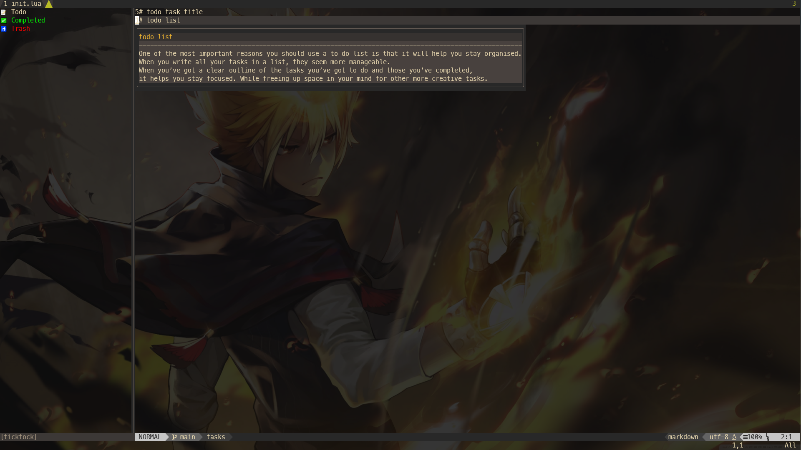

# Ticktock

A neovim plugin help you manage tasks.

> This plugin is designed to running on Linux / MacOS

If you want to manage tasks on the terminal, have a try with [taskcli](https://github.com/0x00-ketsu/taskcli)

Task datas are stored in [SQLite](https://www.sqlite.org/index.html) database for persistence.
This plugin uses [lua-ljsqlite3](https://github.com/stepelu/lua-ljsqlite3) to perform the database transactions.

 

## Features

- Auto save after edited task (trigger event: `InsertLeave`)

- Support `markdown` language syntax

## Installation

[Packer](https://github.com/wbthomason/packer.nvim)

```lua
-- Lua
use {
  "0x00-ketsu/ticktock.nvim",
  config = function()
    require("ticktock").setup {
      -- your configuration comes here
      -- or leave it empty to use the default settings
      -- refer to the configuration section below
    },
  end
}
```

**Ensure you have `sqlite3` installed locally.** (if you are on `Mac` it might be installed already)

### Windows

[Download precompiled](https://www.sqlite.org/download.html) and set `let g:sqlite_clib_path = path/to/sqlite3.dll` (note: `/`)

### Linux

- Arch

```shell
sudo pacman -S sqlite
```

- Debian and Ubuntu

```shell
sudo apt-get install sqlite3 libsqlite3-dev
```

- AlmaLinux and CentOS

```shell
sudo dnf install sqlite sqlite-devel
```

## Setup

Following defaults:

```lua
-- Lua
view = {
  menu = {
    position = 'left', -- One of 'left', 'right'
    width = 35
  },
},
-- Work under Normal mode
key_bindings = {
  menu = {
    open = {'o', '<CR>'}, -- open and swith to Task View
    preview = 'go' -- preview Task View
  },
  task = {
    create = 'gn', -- create new task
    edit = 'ge', -- edit task
    complete = 'gc', -- complete task
    delete = 'gd', -- delete task
    refresh = 'gr', -- refresh task list
    hover_detail = 'K' -- show task detail in float window
  }
}
```

## License

MIT
